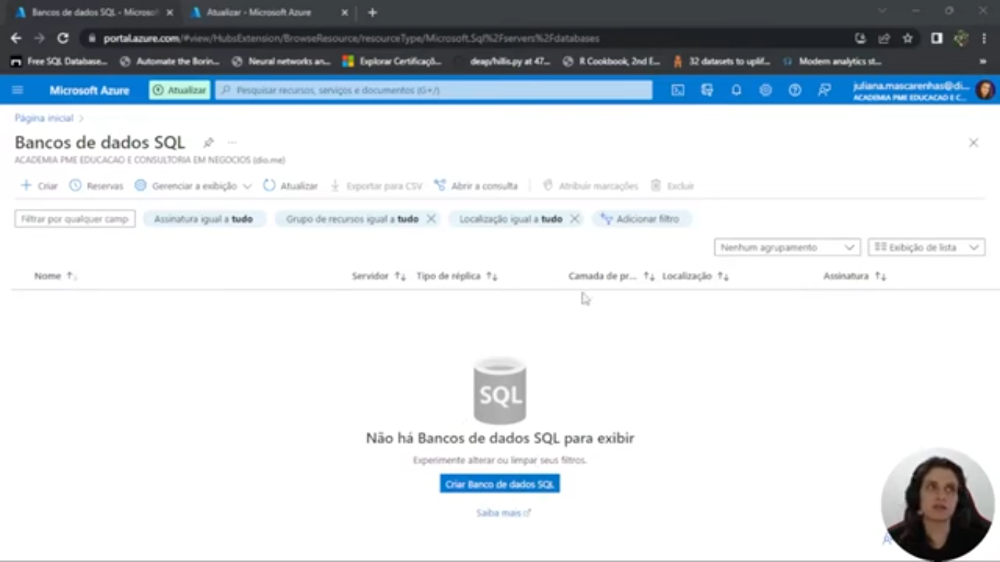
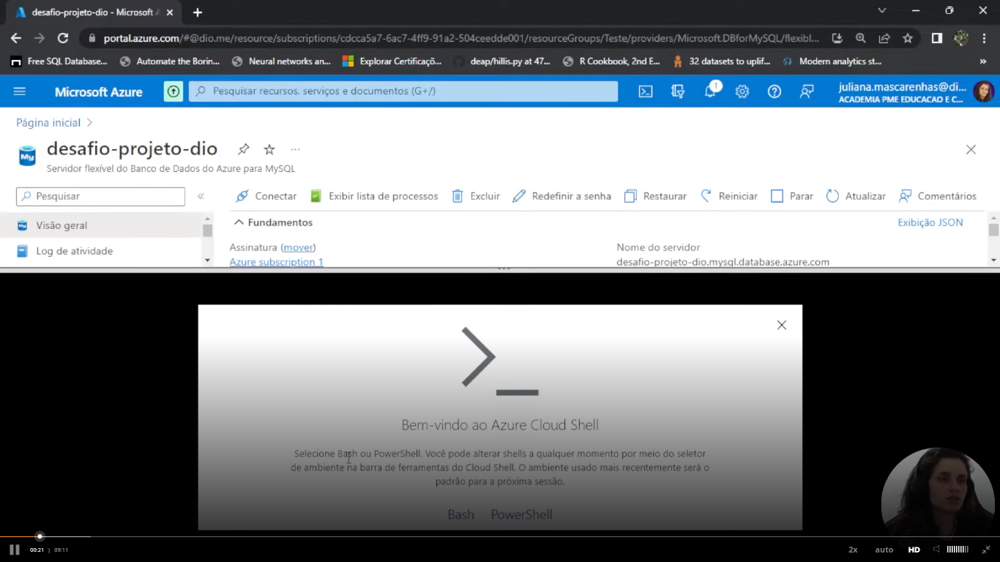
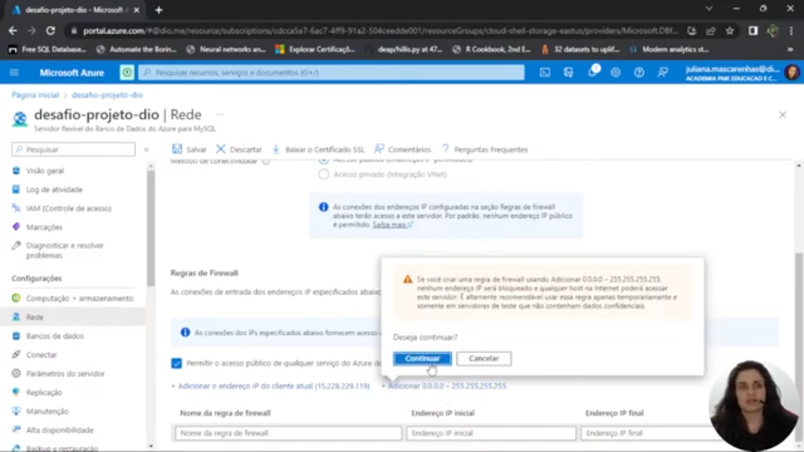
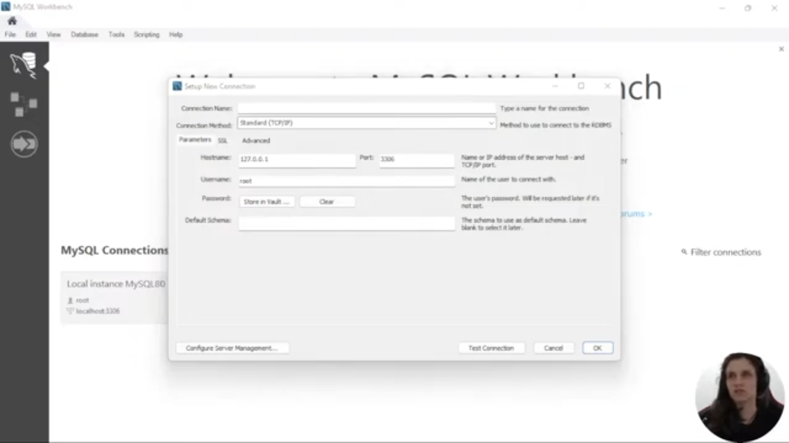
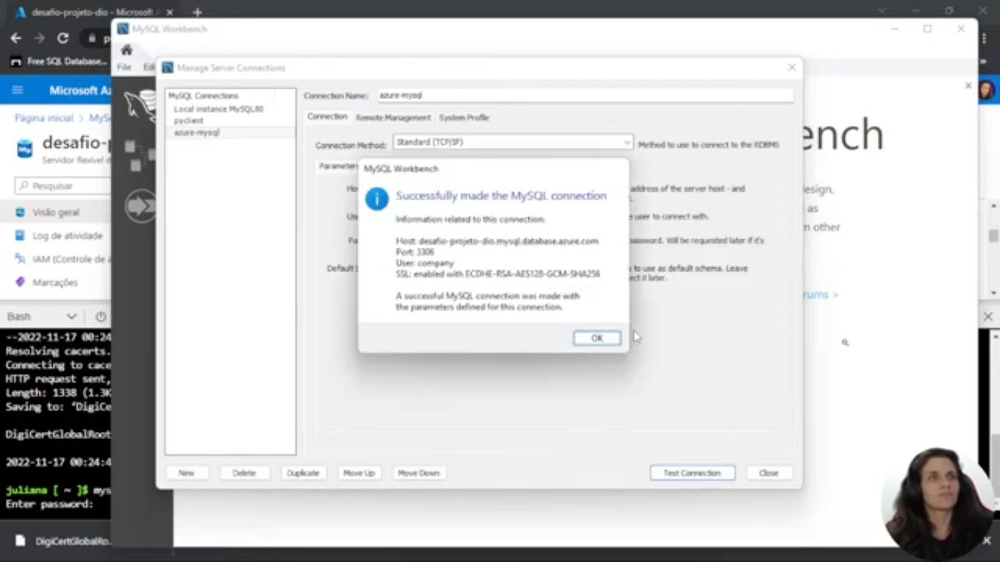
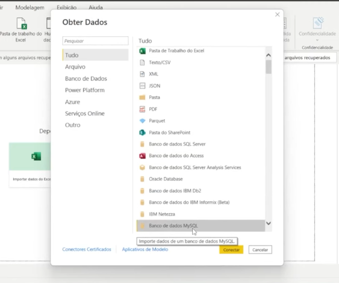
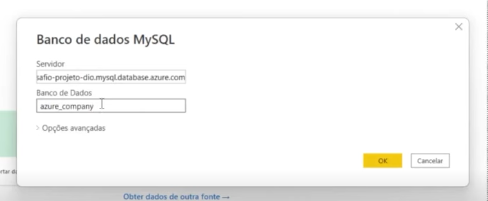

# Criando um Dashboard corporativo com integração com MySQL e Azure
Desafio de Projeto da DIO

> Como eu não possuo mais acesso ao free trial do Azure por já ter utilziado em outro bootcamp, entrego como relatório o resumo das atividades executadas. 

## Criando uma instância do MySQL na Azure

O primeiro passo é acessar o portal da Azure em portal.azure.com.

    

Em seguida, deve-se criar uma instância MySQL Server, ou seja, um Banco de Dados do Azure para MySQL.

    

A aba "Conectar", na esquerda, mostra informações sobre como utilizar diversas ferramentas para se conectar ao banco SQL hospedado no portal Azure.

Através do Azure Cloud Shell ou bash é possível criar um armazenamento, conectar-se ao MySQL, definir o host e criar o database. 

    

Os scripts SQL usados estão disponíveis [nesse repositório do GitHub](https://github.com/julianazanelatto/power_bi_analyst/blob/main/M%C3%B3dulo%203/Desafio%20de%20Projeto/insercao_de_dados_e_queries_sql.sql).

Para ser possível o acesso, é preciso permitir permissões de IP nas Regras de Firewall do Azure. 

    

Para acessar o banco de dados via MySQL Workbench é necessário criar uma nova conexão e inserir as informações, como URL, porta do servidor Azure, arquivo de certificação SSL, entre outros. 

    

    

Uma vez criado o banco de dados, basta selecioná-lo como forma de obter dados através da opção `Banco de dados MySQL`.

    

    

Com os dados importados, o próximo passo é seguir para criação do relatório com o PowerBI.

